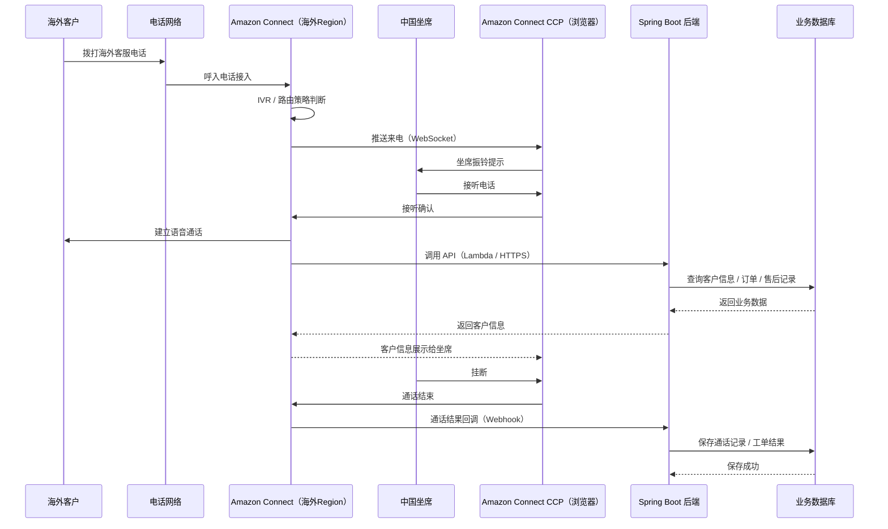

```mermaid
sequenceDiagram
    participant Customer as 海外客户
    participant PSTN as 电话网络
    participant Connect as Amazon Connect（海外Region）
    participant Agent as 中国坐席
    participant CCP as Amazon Connect CCP（浏览器）
    participant Backend as Spring Boot 后端
    participant DB as 业务数据库

    %% 呼入阶段
    Customer ->> PSTN: 拨打海外客服电话
    PSTN ->> Connect: 呼入电话接入
    Connect ->> Connect: IVR / 路由策略判断

    %% 坐席振铃
    Connect ->> CCP: 推送来电（WebSocket）
    CCP ->> Agent: 坐席振铃提示
    Agent ->> CCP: 接听电话

    %% 通话建立
    CCP ->> Connect: 接听确认
    Connect ->> Customer: 建立语音通话

    %% 通话中业务数据获取
    Connect ->> Backend: 调用 API（Lambda / HTTPS）
    Backend ->> DB: 查询客户信息 / 订单 / 售后记录
    DB -->> Backend: 返回业务数据
    Backend -->> Connect: 返回客户信息
    Connect -->> CCP: 客户信息展示给坐席

    %% 通话结束
    Agent ->> CCP: 挂断
    CCP ->> Connect: 通话结束
    Connect ->> Backend: 通话结果回调（Webhook）
    Backend ->> DB: 保存通话记录 / 工单结果
    DB -->> Backend: 保存成功
```