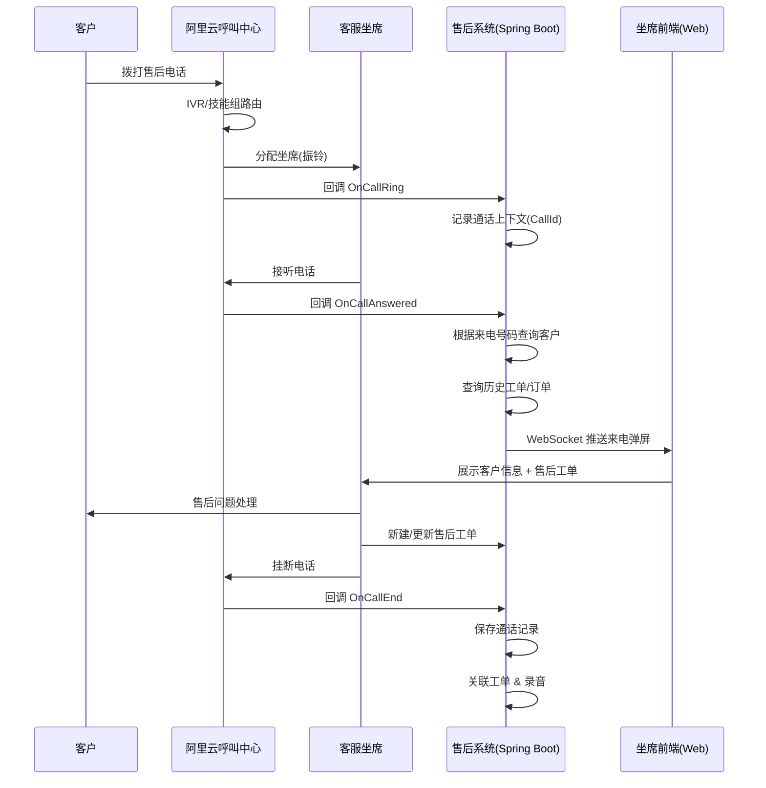

```mermaid
sequenceDiagram
    participant Customer as 客户
    participant CCC as 阿里云呼叫中心
    participant Agent as 客服坐席
    participant Backend as 售后系统(Spring Boot)
    participant Frontend as 坐席前端(Web)

    Customer ->> CCC: 拨打售后电话
    CCC ->> CCC: IVR/技能组路由
    CCC ->> Agent: 分配坐席(振铃)

    CCC ->> Backend: 回调 OnCallRing
    Backend ->> Backend: 记录通话上下文(CallId)

    Agent ->> CCC: 接听电话
    CCC ->> Backend: 回调 OnCallAnswered

    Backend ->> Backend: 根据来电号码查询客户
    Backend ->> Backend: 查询历史工单/订单
    Backend ->> Frontend: WebSocket 推送来电弹屏

    Frontend ->> Agent: 展示客户信息 + 售后工单

    Agent ->> Customer: 售后问题处理
    Agent ->> Backend: 新建/更新售后工单

    Agent ->> CCC: 挂断电话
    CCC ->> Backend: 回调 OnCallEnd

    Backend ->> Backend: 保存通话记录
    Backend ->> Backend: 关联工单 & 录音

```