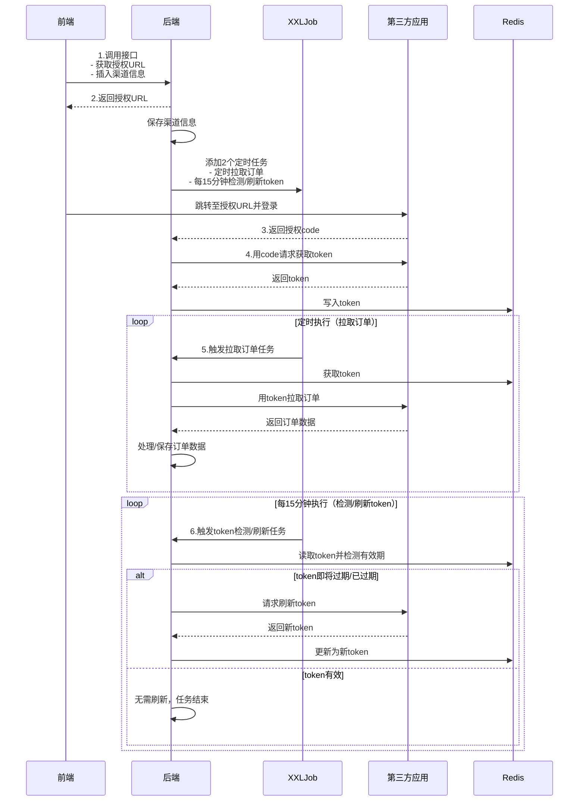

```mermaid
sequenceDiagram
    participant 前端
    participant 后端
    participant XXLJob
    participant 第三方应用
    participant Redis

    %% 步骤1：前端调用后端接口（获取授权URL + 插入渠道信息）
    前端->>后端: 1.调用接口<br/>- 获取授权URL<br/>- 插入渠道信息
    %% 步骤2：后端处理并返回结果，添加定时任务
    后端-->>前端: 2.返回授权URL
    后端->>后端: 保存渠道信息
    后端->>XXLJob: 添加2个定时任务<br/>- 定时拉取订单<br/>- 每15分钟检测/刷新token
    %% 步骤3：Amazon登录授权后返回code
    前端->>第三方应用: 跳转至授权URL并登录
    第三方应用-->>后端: 3.返回授权code
    %% 步骤4：后端通过code获取token并写入Redis
    后端->>第三方应用: 4.用code请求获取token
    第三方应用-->>后端: 返回token
    后端->>Redis: 写入token
    %% 步骤5：XXLJob定时执行拉取订单任务
    loop 定时执行（拉取订单）
        XXLJob->>后端: 5.触发拉取订单任务
        后端->>Redis: 获取token
        后端->>第三方应用: 用token拉取订单
        第三方应用-->>后端: 返回订单数据
        后端->>后端: 处理/保存订单数据
    end
    %% 步骤6：XXLJob每15分钟检测并刷新token
    loop 每15分钟执行（检测/刷新token）
        XXLJob->>后端: 6.触发token检测/刷新任务
        后端->>Redis: 读取token并检测有效期
        alt token即将过期/已过期
            后端->>第三方应用: 请求刷新token
            第三方应用-->>后端: 返回新token
            后端->>Redis: 更新为新token
        else token有效
            后端->>后端: 无需刷新，任务结束
        end
    end
```