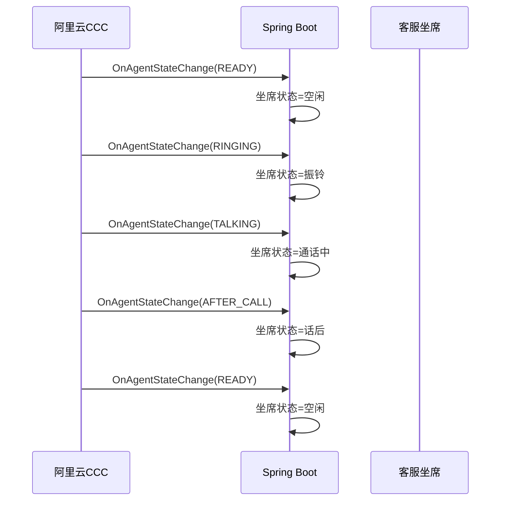

```mermaid
sequenceDiagram
    participant CCC as 阿里云CCC
    participant Backend as Spring Boot
    participant Agent as 客服坐席

    CCC ->> Backend: OnAgentStateChange(READY)
    Backend ->> Backend: 坐席状态=空闲

    CCC ->> Backend: OnAgentStateChange(RINGING)
    Backend ->> Backend: 坐席状态=振铃

    CCC ->> Backend: OnAgentStateChange(TALKING)
    Backend ->> Backend: 坐席状态=通话中

    CCC ->> Backend: OnAgentStateChange(AFTER_CALL)
    Backend ->> Backend: 坐席状态=话后

    CCC ->> Backend: OnAgentStateChange(READY)
    Backend ->> Backend: 坐席状态=空闲

```