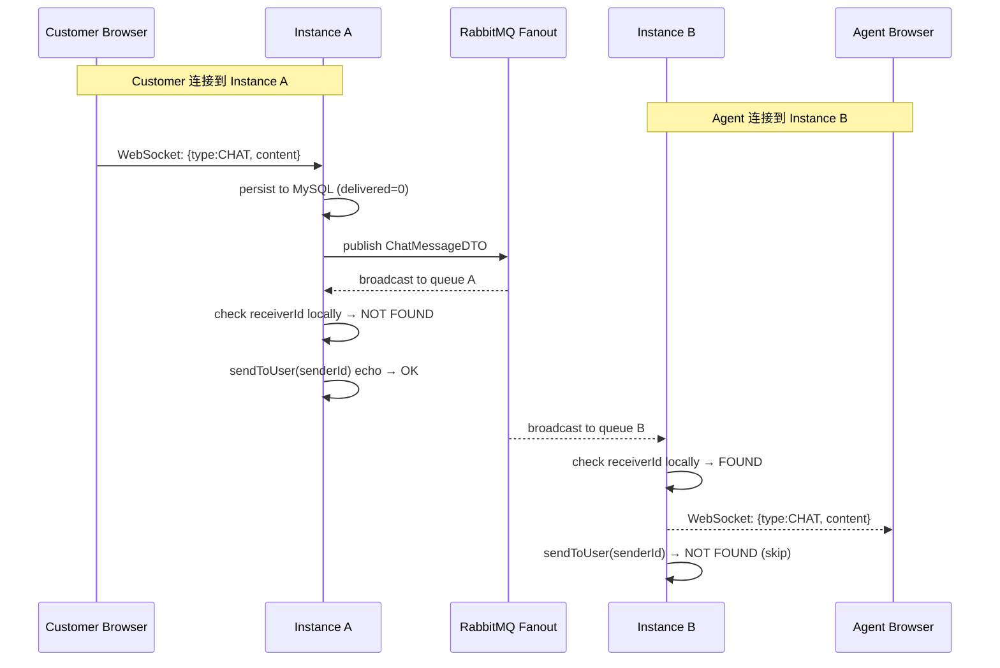

```mermaid
sequenceDiagram
    participant C as Customer Browser
    participant IA as Instance A
    participant MQ as RabbitMQ Fanout
    participant IB as Instance B
    participant A as Agent Browser

    Note over C,IA: Customer 连接到 Instance A
    Note over A,IB: Agent 连接到 Instance B

    C->>IA: WebSocket: {type:CHAT, content}
    IA->>IA: persist to MySQL (delivered=0)
    IA->>MQ: publish ChatMessageDTO

    MQ-->>IA: broadcast to queue A
    IA->>IA: check receiverId locally → NOT FOUND
    IA->>IA: sendToUser(senderId) echo → OK

    MQ-->>IB: broadcast to queue B
    IB->>IB: check receiverId locally → FOUND
    IB-->>A: WebSocket: {type:CHAT, content}
    IB->>IB: sendToUser(senderId) → NOT FOUND (skip)
```